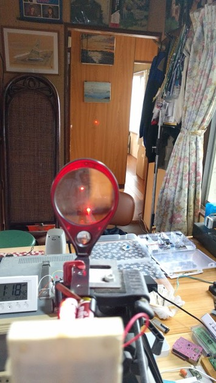

# これからのロバチャン展開 
##  第４回 SECCON2023 Contest of Contest 開催！コンテストの企画案
提案者： 今岡通博

連絡先： imaoca@gmail.com

# 自己紹介
~~~
今岡　通博
愛媛県松山市在住、61歳
自営　今岡工学事務所
組込み系、FPGA、執筆
2014- Microsoft MVP (Windows Development)
2015- セキュリティ・キャンプ講師
2019- Sechack365 トレーナー
2020-2021 Blackhat USA Arsenal presenter
~~~
# これからのロバチャン展開
本来のロバチャンは物理障害のあるLANケーブルを通してプロトコルの強靭さを競うコンテストである。今回の提案はそのロバチャンのスキームはそのままでメディアを替えて、プロトコル強靭さを競う競技を提案する。

# 光 ロバチャン
従来のロバチャンがLANケーブルというメディアを使っていたのに対し光ロバチャンはそれを光通信に替えたものです。光学的な工夫で到達距離と信頼性を稼ぐか電子工学的な手法、あるいは情報工学的な要素でを駆使して信頼性のあるプロトコルを設計するか評価軸が多くなるのでレギュレーションの設定にはそれぞれの専門分野の知見が必要となる。

# 電波　ロバチャン
従来のロバチャンのLANケーブルを無線（RF）に置き換えたコンテストである。電波を使う競技の場合は電波法等の法令を遵守が求められるので、空間に電波が漏洩しないように同軸ケーブル内でコンテストを行う必要がある。図の基板は電波信号をソフトウエアから送受信の制御が行えるモジュールである。

# 水中　ロバチャン
水中ロバチャンはLANケーブルから水中にメディアを置き換えたものである。実際は音波あるいは超音波を用いた通信である。これも光ロバチャンと同様到達距離と通信の信頼性を問う競技となる。
昨今、海洋においても国防や資源開発などで近隣諸国との摩擦が顕著化することが予想される。海中においての音波・超音波を用いた通信手段は重要度が高まってくる。そのような事態においても水中での通信の盗聴や妨害あるいはなりすましなどの攻防を制する技術の知見を積むコンテストは必要と思われる。

# ワイヤー　ロバチャン
LANケーブルを長距離のメタルケーブルに置き換えた通信において到達距離と信頼性を競う競技である。古典的な通信メディアであるが、電気通信の基本を一から会得するにはこのようなメディアでコンテストを行うことは有意義である。

# 音響 ロバチャン
これは音響帯域を用いた空間伝送のコンテストである。PCやモバイル端末は音声入出機能を標準で備えているので、近距離の通信手段としては外付けハードウエアなしでも実現可能な通信手段である。
これらが普及した場合、やはり悪意を持った第三者からの通信の盗聴や妨害あるいはなりすましなどの攻撃に対する対応が必要である。本提案はそれらの知見を積むためにも必要なコンテストである。

# 衛星 ロバチャン
衛星通信、特に低軌道衛星の利用が広がっている。しかしそれらは衛星に対して比較的容易な設備で送受信が可能である。例えば海難事故に対応するために事故船舶や遭難者が自動で発信する小型の送信機を身に着けているが、それはとても簡単なもので様々な妨害に対して脆弱である。それらの脆弱性に目を向けるためにもこのコンテストの実施を提案したい。

# まとめ
今回は様々なメディアにおける通信の強靭性を競うコンテストを提案した。このコンテストの旨味はすでに何度か実施した元祖ロバチャンで蓄積したノウハウがそのまま使えるエコシステムにある。ぜひご検討頂ければ幸いです。